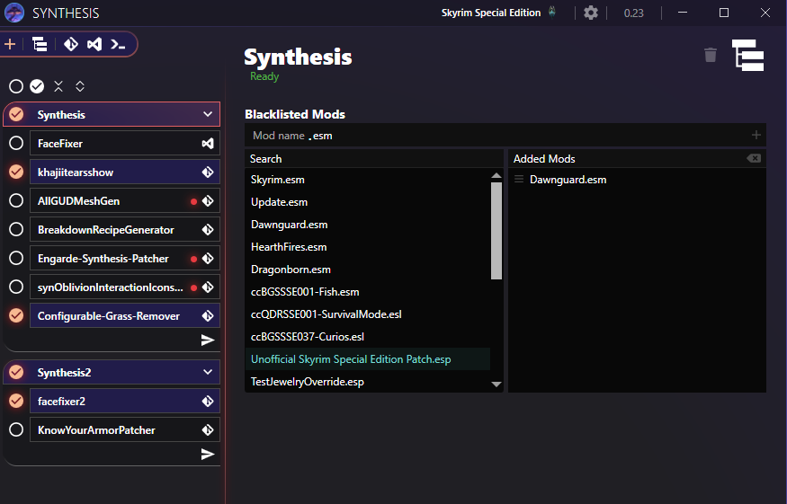

# Blacklisting Mods

## By Group
Synthesis Groups can blacklist mods.  To do so, click on the Group of interest, and a UI should show that lets you pick the mods to not include during patching of that group.

## By Patcher
### Patcher Settings
Individual patcher developers can decide to offer patcher settings that expose a mod blacklist as they see fit.

If a patcher does not offer the setting, it is something they can decide to add.  Perhaps add a request on the patcher's Github page.

### Synthesis Provided Per-Patcher Blacklist
Synthesis itself does not provide functionality to blacklist a mod for a specific patcher.  There's an [issue for it in the works](https://github.com/Mutagen-Modding/Synthesis/issues/285).

In the meantime, if a patcher does not offer a mod blacklist within its own settings, your best option is to put the patcher by itself in a Group and use the blacklist it offers, as described above.
