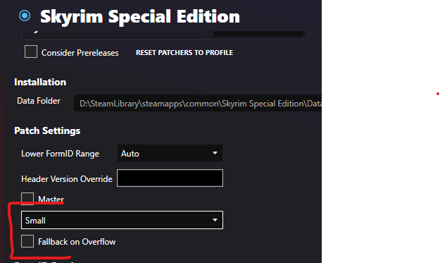

# Compaction

Mods in newer Bethesda games can have specific flags marked to enforce specific compaction of their records so the game can load more of them.   The game engine can load more of these mods with smaller compaction, but the tradeoff is those mods can define less overall records.

These are often referred to as `Small`/`Medium`/`Full` master mods.  Skyrim often refers to `Small` as `Light`.   By default, Synthesis exports as `Full`, for simplicity, and to allow as many records as possible to be defined within a patch mod.

If you would like to adjust the compaction style of your patches, the profile settings have a few settings.

Here, you can select `Small`/`Medium`/`Full` as applicable to your target game.

Additionally, `Fallback on Overflow` can be selected to automatically use "larger" compaction settings if the smaller one selected overflows and contains too many records.

!!! bug "Starfield"
    Starfield is less flexible with compaction styles changing on the fly, so "Fallback on Overflow" is not recommended, and changing compaction styles in general should be done rarely.