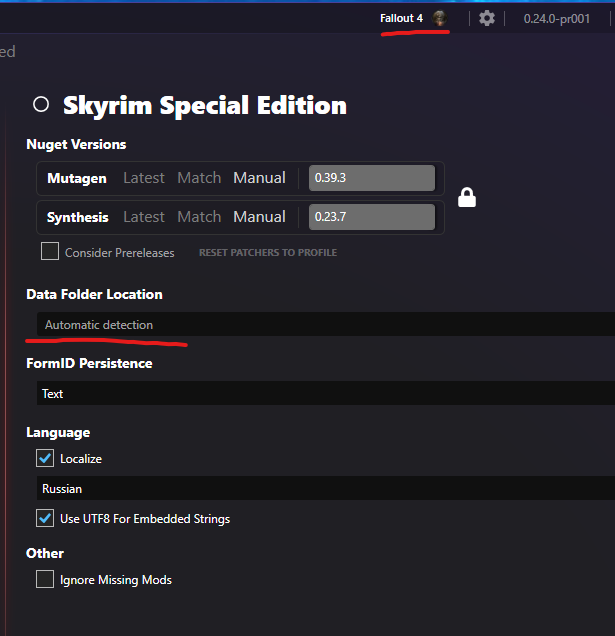

# Data Folder

Synthesis by default looks at the typical game registry areas to automatically locate the installation folder for the targeted game.   However, if you have multiple installations, you may want to override and have Synthesis target a different location. 

This can be done by editing the profile settings:

It should then look to the new location when reading/writing mods.   You can leave it blank to go back to automatic location logic.
