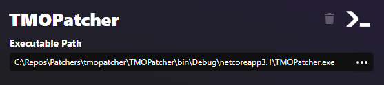

# External Program Patcher
This type latches on and executes any executable program (exe).  It will pass along the Synthesis [command line arguments](devs/Patcher-CLI.md) to inform the program of what it should be patching, and where to put its results.  

## Goals and Reasons to Choose
This patcher type is meant for non-Mutagen based patcher programs that want to participate in a Synthesis patch pipeline.  As long as the program can take in the [command line arguments](devs/Patcher-CLI.md), and produce a patch file in the desired location, it can be a patcher within Synthesis.

!!! tip "Not for Mutagen-Based Patchers"
    This is not typically used with Mutagen-based patchers, as [Git Repository](Git-Repository-Patcher.md) or [Local Solution](Local-Solution-Patcher.md) are better options.

## Required Input
The only required input is a path to the executable file to run.
