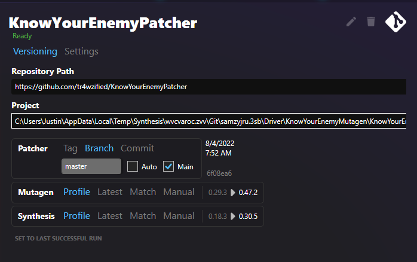

# Git Repository Patcher
This type latches on to a patcher accessible via a Git Repository address (usually hosted on Github.com).  ***It will clone the code and build the exe to run locally on your machine***.  It only supports Mutagen-based projects.

!!! success "Recommended"
    This is the recommended patcher type for typical users

## Reasons to Choose
Because it builds code on your machine, it has a few upsides:

- Can automatically update to the latest version of a patcher's code
- Can artificially update a patcher to the latest version of Mutagen/Synthesis to grab bugfixes and optimizations
- Does not require a patcher author to explicitly create and publish an exe to be runnable

## Installation
### Manual Input

The `Input` pane allows you to create a Git Patcher by explicitly providing the repository details

- Address of the git repository
- Project within the repository to use (a repository could have multiple patchers, for example)

### Patcher Browser
Alternatively, you can make use of the "Browse" feature, which lists a whole load of patchers that were automatically located on Github.

To get to the Patcher browser, click and add a new Git Repository Patcher at the top left, and then go to the Browse tab.

## Versioning
Git Repository Patchers have the unique capability of being able to control what code you want to use for a patcher.

This is an important topic, and so has received its own section in the Overview documentation

[:octicons-arrow-right-24: Versioning](Versioning.md)

