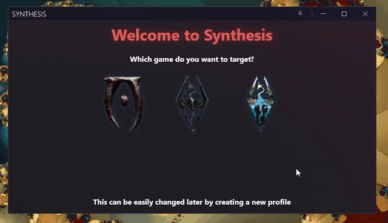

# Installation
## Install Latest .NET SDK
You can get the typical SDK installation from Microsoft's official page

[:octicons-arrow-right-24: Download SDK](https://dotnet.microsoft.com/download)

!!! tip "Latest"
    Install the latest SDK - it can compile patchers targeting any version, including older ones

!!! tip "Restart"
    It's usually a good idea to restart your computer after installing DotNet SDK to help things settle in.

!!! bug "Avoid install/uninstalling SDKs repeatedly"
    If after installing the .NET SDK as instructed above it doesn't work, try following [this FAQ first](https://github.com/Mutagen-Modding/Synthesis/discussions/135)

### Runtime Is Not The SDK

- `.NET SDK` -> Enables you to compile code (required for Synthesis to build patchers)
- `.NET Runtime` -> Enables you to run the resulting exe patcher programs (or the Synthesis UI itself)

Be sure to install the `SDK`; The `Runtime` alone is not enough for Synthesis to compile patchers.  

## Optionally Install Runtimes

You can skip this step and wait to install a missing runtime when you see a patcher fail to run. This usually only happens when running an ancient patcher targeting ancient .NET versions.

[:octicons-arrow-right-24: Download .NET Runtimes](https://dotnet.microsoft.com/en-us/download/dotnet)

The Runtime is version-specific. A patcher compiled for .NET 8 requires Runtime 8 installed to run.  This is why an ancient patcher might require some older Runtime in order to be executed.

!!! info "Multiple Runtimes Can Coexist"
    You can have multiple .NET Runtimes installed simultaneously without conflicts. Install whichever versions your patchers require.

## Download Synthesis UI
To download Synthesis itself, go is the GitHub release section

[:octicons-arrow-right-24: Download Synthesis UI](https://github.com/Mutagen-Modding/Synthesis/releases)

On the latest release, download _just_ the **Synthesis.zip** file.  The other files are not needed.

Unzip the archive into a dedicated folder of its own, somewhere outside of your game install and outside of any mod manager's managed directories.

!!! bug "Unzip All Files"
    Make sure you bring along ALL the files within the zip, not just `Synthesis.exe`

!!! danger "Do NOT Install Inside The Data Folder"
    Synthesis is a tool, not a mod.  Do not place it inside your game's `Data` folder, your Mod Organizer 2 `mods` folder, a Vortex-managed folder, or anywhere else a mod manager virtualizes.  Tools installed in those locations can have their file operations redirected by the virtual file system in ways that may corrupt or delete unrelated files.  A safe choice is something like `C:\Tools\Synthesis\` — a path that no mod manager touches.

!!! tip "Dedicated Folder"
    Synthesis creates several files alongside its executable (settings, logs, a small backup repo).  Always give it its own folder so those files don't mingle with anything else.

## Run Synthesis
You're ready to run Synthesis!

### Are You a User?

Be sure to read the rest of the wiki for how to use the app.

[:octicons-arrow-right-24: Typical Usage](Typical-Usage.md)

!!! info "SDK Problems?"
    Perhaps the SDK installation had some issues.  Check out the [FAQ on the topic](https://github.com/Mutagen-Modding/Synthesis/discussions/135)

### Are You a Developer?
There are a lot of resources on how to get started creating a patcher

[:octicons-arrow-right-24: Create a Patcher](devs/Create-a-Patcher.md)
