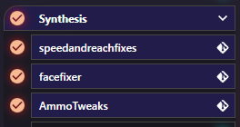

# Load Order
Load Order can affect the results of Synthesis patches in a few ways.  In general, it is preferable for Synthesis patches to exist on the load order when running.  This allows you to control what content they consider when patching, as described below.

!!! tip "Keep In Load Order"
    You do not need to remove Synthesis files from your Load Order before rerunning.  Keep it present and enabled, and just rerun the patcher pipeline to replace the existing file with a new version.

## Patches Only Consider Mods Earlier in the Load Order
A patch being run will only consider the mods that come before it in the load order.  Any mods that come after it are ignored and not seen or considered by the patchers when they are running.

For example:
```
ModA.esp
Synthesis.esp
ModB.esp
```

If a patch pipeline for `Synthesis.esp` was run, `ModA.esp`'s contents would be considered while `ModB.esp` would be ignored.

## Patch Not On Load Order
If Group being run is not on the load order, then it is considered to be last and will consider everything on the load order.

## Building On Previous Patches
Do patchers consider any other patcher's results when running?  
### Within a Group
Patchers within a group build on each other's contents.  An earlier patcher's changes will affect a later patcher's results.



In this scenario, `Speed and Reach Fixes` will run first.  Any changes it makes will be seen and considered as `Facefixer` and `AmmoTweaks` run right after.

Similarly, `FaceFixer`'s adjustments will be seen by `AmmoTweaks` which will make the final adjustments before exporting to `Synthesis.esp`

Occasionally, ordering will matter, as some patcher might want to act on the content that another creates. 

### Between Groups
Group interaction works slightly differently.  Groups see previous Groups' results as if they were a normal mod on the load order.  So the initial Load Order example takes effect.

For example:
```
ModA.esp
Patch1.esp
Patch2.esp
ModB.esp
```

`Patch1`'s run will consider `ModA.esp` when running, and nothing else.

`Patch2`'s run will see `ModA.esp` and also the results of `Patch1`, as it is a "mod" before it in the load order.

`ModB.esp` will not be considered by either, as it is later in the load order.

### Group Order Should Match Load Order
It is important to note that generally Groups should be run in the same order they appear on the load order. 

!!! bug "Mismatched Order Leads to Bugs"
    Running patcher groups in a different order than they appear on the load order can result in inconsistent output

For example, if the Synthesis groups are listed:
```
GroupA
GroupB
```
But are listed in your load order as:
```
GroupB.esp
GroupA.esp
```
Then the following will occur:

- GroupA will run first
- GroupA will see GroupB's contents, but stale from the previous run
- GroupB will run second, and perhaps change its contents

The result is that A has now built itself on an outdated understanding of B.  This may or may not mean the results will not be as expected, and a 2nd run will suddenly "fix" the issue as now A will see B's new results.

Instead, it is recommended to keep the ordering in sync, unless you plan to run the groups independently in some special custom setup.
