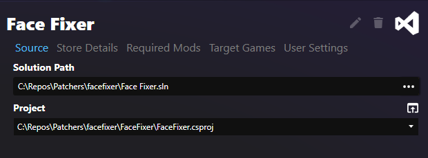
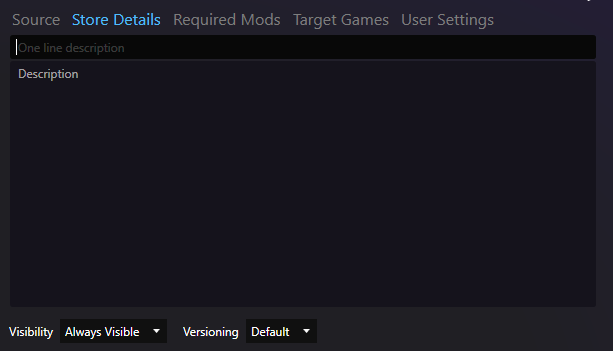

# Local Solution Patcher
This style uses a local C# project which is compiled and run as a patcher.

## Goals and Reasons to Choose

- Preferred route any time you want to run raw code from a folder that you downloaded/created yourself
- Can create new patcher Solutions/Projects or latch on to existing projects
    - Generated solutions come with a lot of initial settings configured for you, such as Nullability errors.
- Code can be developed in an IDE on the side, but run from within Synthesis as part of a larger patcher pipeline. 
- Meta information tooling is offered to customize the patcher's information such as descriptions/nicknames/visibility in the patcher browser

!!! tip "Preferred for Developers, When Needed"
    While this is the preferred patcher choice for developers, note that running during normal development should be done from your IDE, and not through the Synthesis UI

[:octicons-arrow-right-24: Running a Patcher](devs/Running-and-Debugging.md)
	
## Required Input
The basic input required is:

- Path to a solution
- A dropdown of related projects will populate, of which one should be chosen.

## New Patcher Wizard
Synthesis is able to construct new patcher projects for you that contain a lot of starting frameworks and default settings.

It is able to construct whole Solutions from scratch, or add a new project to an existing solution, or latch onto existing projects.

## Patcher Settings
A patcher has a Synthesis specific meta file where you can specify patcher description, among other things.  The Solution Patcher has built in GUI controls for modifying/creating this file:

Settings you can modify:

- Patcher display name
- One line description
- Multi-line extended description
- Whether to show in the [patcher browser](Git-Repository-Patcher.md#patcher-browser) by default
