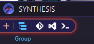
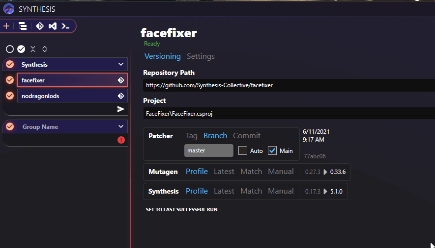

# Multiple Output Targets
By default, Synthesis comes with one large group, named Synthesis.  Putting patchers inside and running them results in all of their content being added to one single mod named `Synthesis.esp`.

## Synthesis Groups
Synthesis can also be set up to export different patcher results into different mods.  
Synthesis groups is a feature that helps organize what patchers will go into what mod files.

Each group will export its contained patchers into a mod with the name of the group.
A group named `MyPatch` will be exported to a mod called `MyPatch.esp`

### Adding a Group
Clicking the new group button will add a fresh group to your pipeline

### Renaming a Group
After creating a new Group, you will want to give it a name before it is usable.  This can only be done by focusing the group and renaming it in the right side panel

### Adding Patchers to Group
With the group selected, you can then add patchers to the new group as normal.  Just make sure to click on the group you want to add the patcher to before adding the patcher.

### Moving Patchers between Groups
You can also drag drop patchers between groups, and reorder them if the patchers you're choosing care about order.

## Running With Multiple Groups
### Run Whole Pipeline
You can run the whole pipeline by clicking the run button at the bottom left of the UI.  This will run all of your groups in order one after another.

!!! bug "Keep Groups In Sync With Load Order"
    Group order must match load order [Read More](LoadOrder.md#group-order-should-match-load-order)
	
## Running a Single Group
You can also run a single group in isolation, rather than generating all groups at once.  This is sometimes useful, but generally is less safe than running the whole pipeline.  
