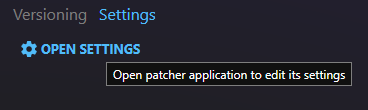

# Patcher settings

Typically, the settings file will end up here:

`[Path To The Synthesis Exe]/Data/[Profile Name]/[Patcher Name]/`

## Instructions

Each patcher is different and can be coded by the developers to get input from the user however they see fit.  It is recommended to check the instructions provided with each patcher for any details or extra instructions.

## Embedded Settings UI

Synthesis as an ecosystem provides an easy way for patcher developers to hook into a settings UI within Synthesis itself.  

Some patchers might use this area for their settings, but not all will.

## Open For settings

Some patchers that are more advanced will make thier own UIs.  Synthesis can open them from the same area it displays its own settings.

This will open the patcher's own UI over the Synthesis UI.

