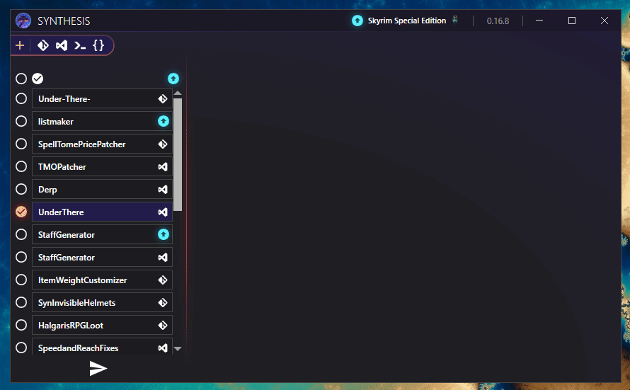

# Sharing Your Setup

So you have a good set of patchers and settings that you want to share!

## Use the Profile Export
The profile area has a dedicated button for exporting a copy of your Synthesis settings, specialized for sharing with others.

You can then give others those settings instead, which will have a few tweaks to help ensure they get the same setup you intended to pass on to them.

### Automatic Update Settings Turned Off
All automatic update settings are turned off, such as following the target branch's latest commit automatically.

This helps ensure people download the same version you were using at the time of export, without any unexpected auto updates.

### Lock To Current Versioning Turned On
There is a setting in the profile area named "Lock to Current Versioning".  This is turned on, which blocks interaction with any versioning settings, and hides all blue update arrows.  This helps discourage users that might be tempted to just click all the update buttons as soon as they open Synthesis.

### Clears Out Other Profiles
Other profiles besides the one selected are trimmed out, so that only the profile you meant to pass off gets included.

### Other Tweaks in the Future
As other settings come out, they will appropriately be tweaked for Export when using this feature to work best for handing off to other users.
