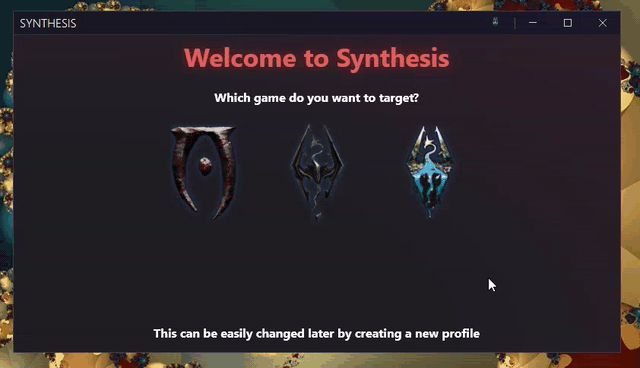
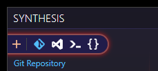
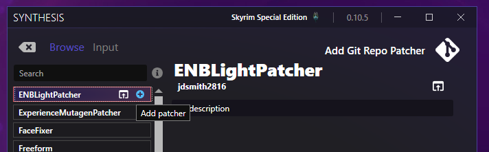
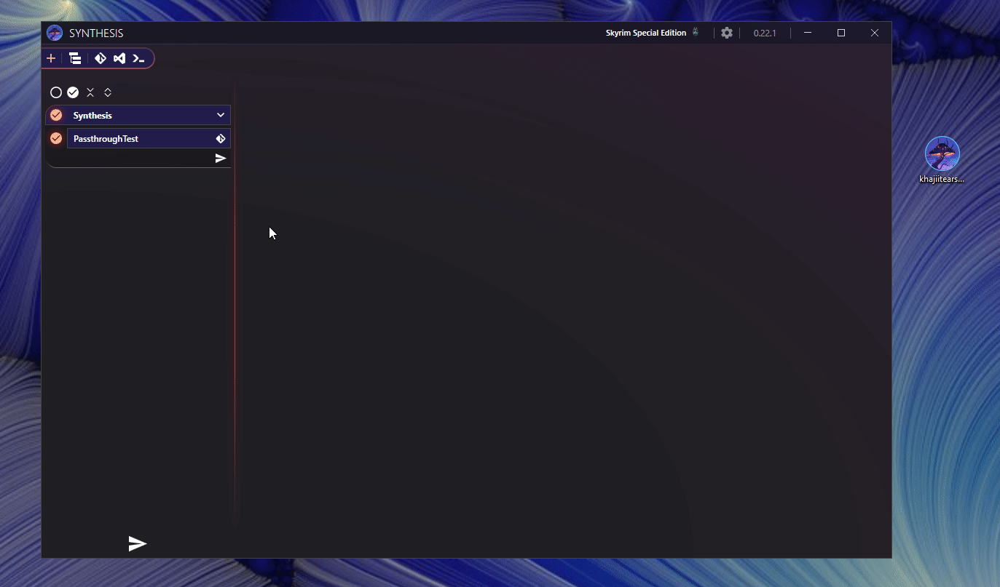
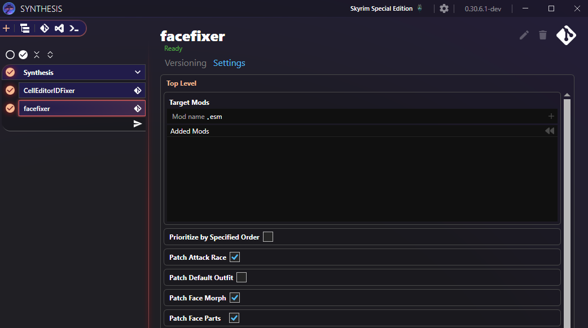
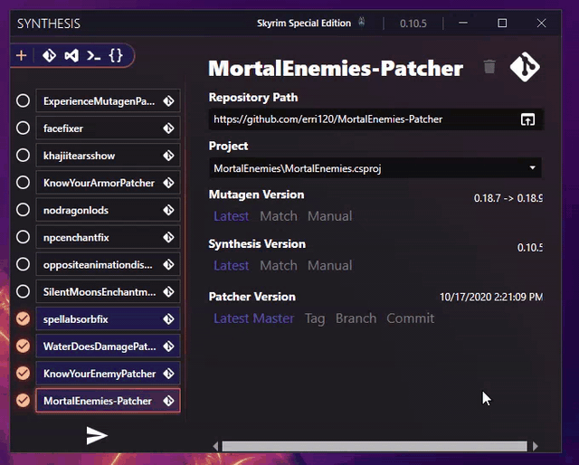

# Typical Usage
This clip is a good visual example of typical usage, but this page will be going over it in more detail.

## Adding Patchers
### Select a Patcher Type
There are a few alternatives, but the one recommended for new users is the [Git Repository patcher](Git-Repository-Patcher.md).

### Installing a Git Patcher
#### Browse
You can either look around in the wild yourself, or you can make use of the built in list of existing patchers.  Within a `Git Repository` patcher, there is a `Browse` section with an automatically populated list:

!!! info "Automatically Populated"
    This list is automatically populated via a [Synthesis Registry](https://github.com/Mutagen-Modding/Synthesis.Registry)

#### Input Tab
If you have a specific github address you want to use you can paste it directly into the `Input` tab.

#### .synth files
Synthesis patchers can be distributed via `.synth` files.  These files simply instruct the program to add the patcher as if you did the above steps.  

To use a `.synth` file:

- Open Synthesis
- Select the group you want to add the patcher to.  Initially there is only one, so you can skip this step
- Double click the `.synth` file on the desktop

[:octicons-arrow-right-24: .synth Files](Synth-File.md)

## Patcher Settings
Some patchers either require extra input, or offer customization options.  Some use the settings panel within Synthesis itself, while others use extra json files.

Read more about how settings are handled in Synthesis

[:octicons-arrow-right-24: Patcher Settings](Patcher-Settings.md)

!!! tip "Each Patcher is Different"
    Each patcher can expose their settings files however they like, and not all patchers have settings.  Refer to the specific patcher's documentation.
	
## Patcher Versioning
Synthesis can artificially upgrade patchers to newer versions of Mutagen to get fixes and upgrades locally, even if the original developers haven't updated in a while.  

[:octicons-arrow-right-24: Recommended Versioning Setup](Versioning.md#recommended-setup)

The recommended setup will give you precise control over when you upgrade, while allowing you to revert patchers that have problems running into hyper compatibility mode.

## Running the Patcher Pipeline
Once you have a list of patchers, you can run them to create a single `Synthesis.esp` patch file which will contain all the changes from the patchers.  

You can click on any specific patcher to see specifics about it, or any errors it may have printed. 

Running the pipeline will export a file [per patcher group](Multiple-Output-Targets.md) to your `Data` folder.

[:octicons-arrow-right-24: Customizing Data Folder Location](DataFolder.md)

[:octicons-arrow-right-24: Multiple Output Files](Multiple-Output-Targets.md)

!!! tip "Mod Manager Interception"
    Some mod managers like Mo2 "intercept" new files.  If there are no errors in Synthesis, but you're not seeing its output in the Data folder, then your mod manager might be intercepting.

## Enable in your Load Order
Once a patch is created, you'll want to use your favorite tool to view the results (like xEdit) and then add the patch to your load order!

You do not need to remove Synthesis from your Load Order before rerunning.  Keep it present and enabled, and just rerun the patcher pipeline to replace the existing file with a new version.

[:octicons-arrow-right-24: Load Order](LoadOrder.md)

## Read The Rest of the Wiki
This page is just a brief overview of how to get started.  Be sure to read the rest of the wiki!