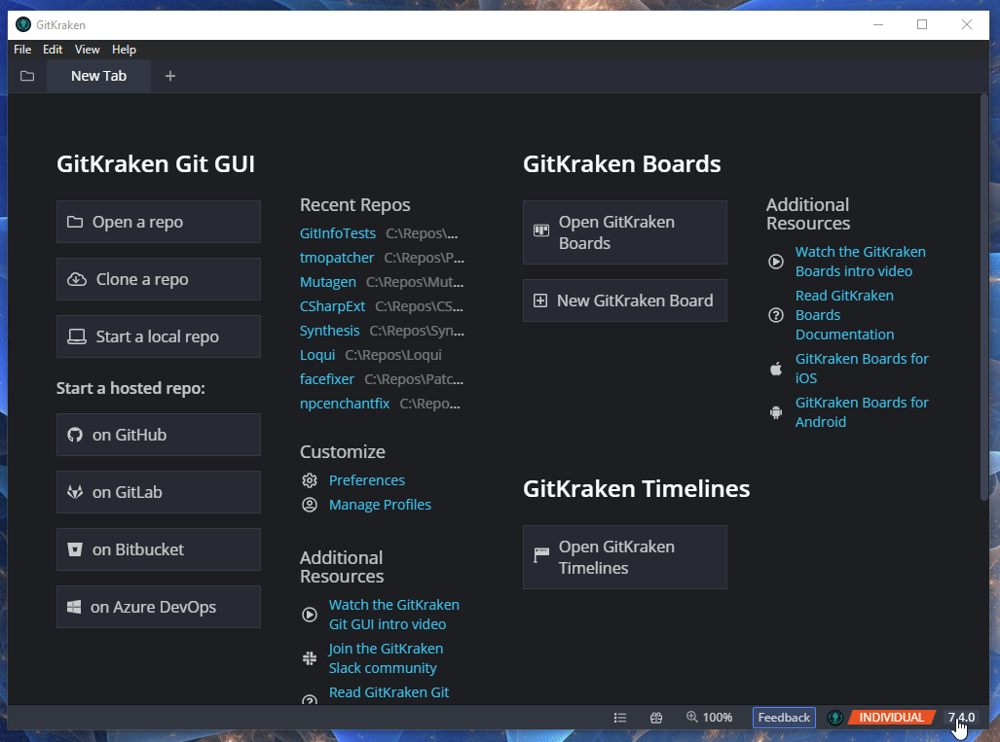
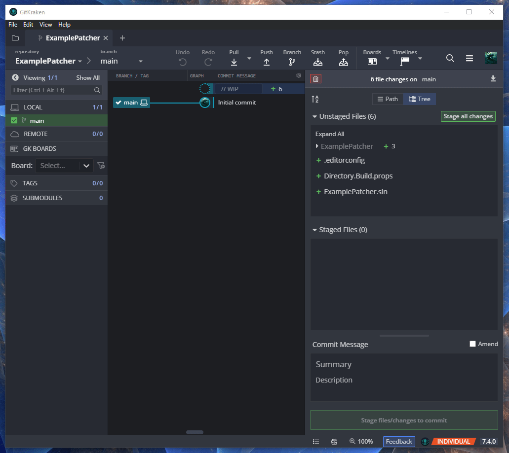
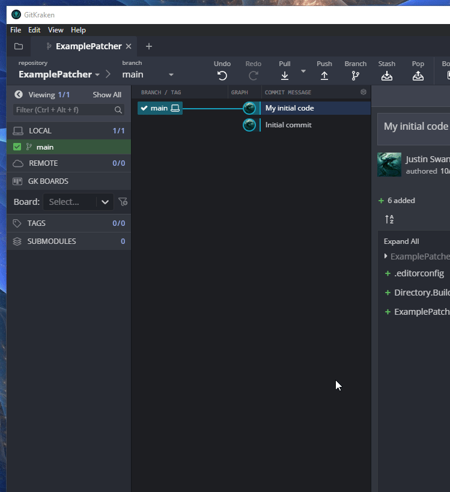
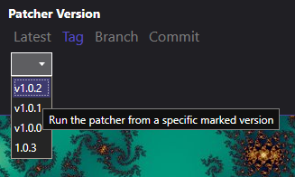
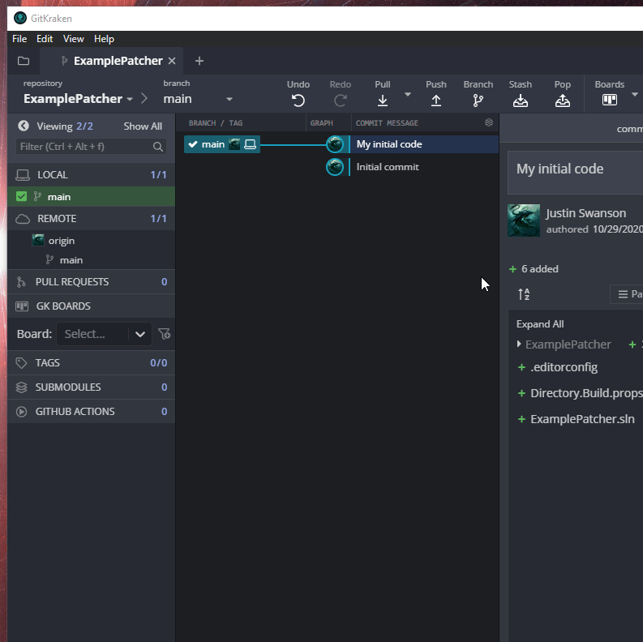
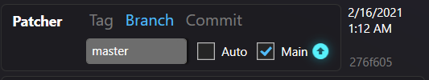

# Publishing

Once you have a patcher that you want to share with the world, there are a few options:

## Upload to Github
Uploading to Github is the preferred route for publishing a patcher.

- Automatically listed in the Patcher Browser registration systems.
- Still can be used with the [Nexus](https://github.com/Mutagen-Modding/Synthesis/wiki/Nexus-Integration)
- Easy versioning via [tags](https://github.com/Mutagen-Modding/Synthesis/wiki/Publishing-a-Patcher#versioned-tags-to-mark-releases)
- Easy exposure of "experimental" versions to willing users via [branches](https://github.com/Mutagen-Modding/Synthesis/wiki/Publishing-a-Patcher#branches)
- Gives your end users ability to [upgrade to newer Mutagen/Synthesis versions](https://github.com/Mutagen-Modding/Synthesis/wiki/Git-Repository#mutagensynthesis-version) without bugging you
- Will hook in to [systems](https://github.com/Mutagen-Modding/Synthesis/issues/42) to improve overall patching speed, that will be developed in the future
- Source code is viewable, and people can help improve it with PRs

### Some Resources
If you're new to Git, don't worry.  This wiki page should go over the gritty details you specifically need to get up and running.

If you want to learn more about Git in general, though, there are a lot of [resources online](https://www.gitkraken.com/learn/git/tutorials).

### How to Upload

- Create a Github Account
- Find your preferred Git tool
- Create a Local Git Repository
- Commit your code
- Upload

#### Create a GitHub Account
Sign up for a [GitHub](https://github.com/) account if you haven't already.  It's free.

#### Find your preferred Git tool
For the purpose of this tutorial, [GitKraken](https://www.gitkraken.com/) will be the git client of choice.  There are a lot of options to choose from.

#### Create a Local Git Repository
Using the GUI, create a local repository on the Solution folder.

#### Commit your code
Git is essentially a code saving tool, with the ability to easily see changes and teleport to any saved state in the past.  There are a lot of tutorials on the internet, so this wiki will not go over all the basics besides the absolute essentials.

To save your code, you will want to make a commit

In the center, you will notice a `WIP` section, which means you have code that is not saved.

By moving files from the `Unstaged Files` section on the right-hand side to the `Staged Files`, you are marking the files to include in the commit (save).

After typing in a message, you can then commit and save your code.  Once you do more work, you will notice more `WIP` code that you can then make another save with another commit later on.

#### Upload
First, you will want to log into Github within GitKraken's preferences.

After logging in, you can initialize and upload to Github within the GUI itself.

Your code is now on Github!  Synthesis will automatically pick it up, and show it within the Patcher Browser.

### Versioning
An important part of exposing your patcher to the world is properly versioning.  This helps users control and decide what version of code they want to use.

#### Versioned Tags to mark releases
You can stamp specific commits with a tag to mark it as a version users can choose from.  

User's perspective:

To create a tag, simply right click the commit you want to mark

You can type anything as the tag name, but it is recommended to follow [semantic versioning](https://semver.org/).

#### Branches
Branches help to separate stable code from experimental code.  By default, `master`/`main` branch is the published stable code.  One pattern you can choose is to keep the `main` branch as your stable code, while pushing new work to a side `dev` branch until it is deemed stable.

Additionally, extremely experimental code can be put on different named branches.  When working with users on fixing/trying new stuff, you can tell them to use the code from a specific side branch.  If the experiment works out, you can merge the code into `main`, or delete the branch entirely.

User's Perspective:

## Patcher Browser Registration
The Synthesis UI features a patcher browser which allows users to easily search and add patchers right within the app.

This listing is populated by a [periodic scraper](https://github.com/Mutagen-Modding/Synthesis.Registry) that compiles the big list of available patchers.  In order to show up in the patcher browser, you need to show up on that list.

In order to be found/listed there are a few requirements:

- In a git repository uploaded to GitHub.com
- Solution is top level (#211)
- At least one patcher project which imports the `Mutagen.Bethesda.Synthesis` NuGet package
- (Optional) Patcher meta json file specifying description and other information.  These can be made easily by utilizing the [Solution Patcher](https://github.com/Mutagen-Modding/Synthesis/wiki/Local-Solution) system made for devs

The [Local Solution patcher wizard](https://github.com/Mutagen-Modding/Synthesis/wiki/Local-Solution) will create an automatically compatible setup **EXCEPT** the first step of creating and uploading to GitHub.  This responsibility is on the patcher developer to create their Github presence.

**NOTE:** 
It is possible to have a single solution with several patcher projects underneath.  Whether you prefer a separate solution and repository per patcher, or one large repository with several patchers is up to personal preference.

### Troubleshooting Registration
### Github Dependency Graph
The scraper tech functions by looking at the GitHub dependency graph systems.  The list can be found here:
<https://github.com/Mutagen-Modding/Synthesis/network/dependents>

There is also a list on your patcher side, where it shows what it is dependent on.  This will be in the same area, just in your own repo.

If you don't find your patcher on this list, then the scraper will not see your patcher and so it will not show up.

First, double check that you've actually imported `Mutagen.Bethesda.Synthesis` into your project, as that's what drives it.   Second, sometimes Github doesn't populate these lists as we'd desire.   Some have solved the issue by going to their patcher's dependencies list, and refreshing the page.   Otherwise sometimes you have to [open up a ticket with Github](https://docs.github.com/en/support/contacting-github-support/creating-a-support-ticket) and tell them to poke the system on their end.

#### Error During Scraping
Sometimes there can be error during the scraping event.   The scraper system tries to list all the patchers it saw on the list, and whether they were excluded and why.  [The readout can be found here](https://github.com/Mutagen-Modding/Synthesis.Registry/blob/release/scrape-state.txt)

If you see your patcher with an error, see if it makes sense and if you can adjust for what it's complaining about.

## Build Executable
You can also build an executable, and distribute the `exe` directly for users.  They would then add it as an [External Program Patcher](https://github.com/Mutagen-Modding/Synthesis/wiki/External-Program)
