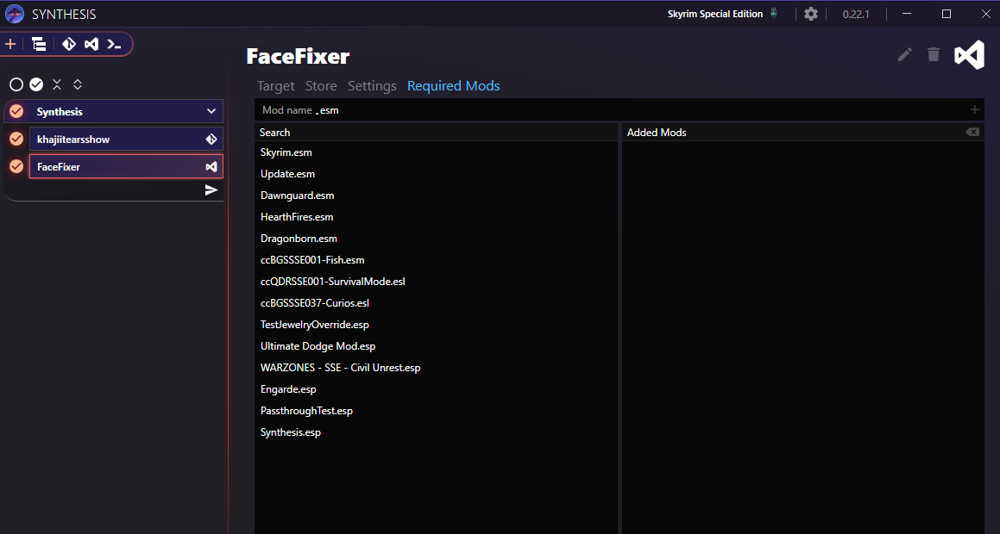

# Required Mods and Runnability Checks

Often a patcher requires some mods or has some other requirements where it knows it will fail if certain things aren't present or correct.

These can be written into a Runnability check, which Synthesis will run ahead of time before the user has even started a patching run.  If the check fails, then Synthesis will warn the user and block them from starting.   This is helpful, as if you instead put the check inside your RunPatch logic, then the user will find out way later perhaps after they've waited several minutes for patchers earlier in the pipeline to complete.  It's best to fail and warn as early as possible.

## Runnability Check

Adding a Runnability check is as easy as adding the RunPatch callback.

```cs
public static Task<int> Main(string[] args)
{
    return SynthesisPipeline.Instance
        // Add the runnability check via the pipeline builder
        .AddRunnabilityCheck(CheckRunnability)
        // The normal other items
        .AddPatch<ISkyrimMod, ISkyrimModGetter>(RunPatch)
        .SetTypicalOpen(GameRelease.SkyrimSE, "YourPatcher.esp")
        .Run(args);
}

public static void CheckRunnability(IRunnabilityState state)
{
    // Check and throw exceptions as necessary
}
```

Synthesis will identify this function exists and call it when it's interested if your patcher is runnable.

### Best Practices
Runnability checks are meant for quick easily verifiable items like the presence of mods/files/etc. 
Synthesis may run them often.  It's best to keep these checks as cheap as possible and not do any work within them.

If an obscure requirement takes a lot of work to identify whether it would succeed or not, and might take several seconds to calculate, then that's best to keep that expensive logic within the RunPatch side.

## Required Mods
Given that this is a common requirement of patchers to have a mod they require, there are special systems in place to help facilitate this.

### Via Meta File
If you add your patcher as a Solution Patcher to Synthesis, then it will offer you a convenient place to add Required Mods in the UI.



This route is preferable, as it adds the required mods to a meta file that is committed alongside the code.  Scrapers and other tools are more easily able to identify required mods for a patcher when they're listed this way.

### Via Runnability Check Function
You can also add the required mods check to an existing runnability function with some provided convenience methods:
```cs
public static void CheckRunnability(IRunnabilityState state)
{
    state.LoadOrder.AssertListsMod("RequiredMod.esp");
}
```
