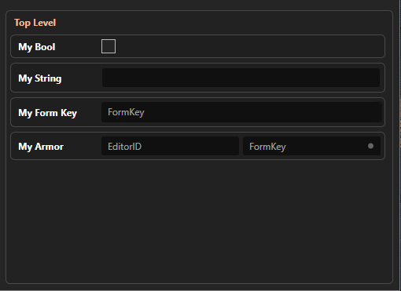

# User Input 

There are a few ways patchers can retrieve input from the user.

## Automatic Settings UI System
Typically users don't like interacting with raw configs.  The format looks like code, is heavily error prone, and does not have any helpful functionality to fill things out for the user or ensure the input is correct.

Synthesis offers an alternative to raw configuration files to instead provide an out of the box UI for settings.  

### Define Some Settings
As a developer, you provide a class with the fields you would like to expose:
```cs
public class TestSettings
{
    public bool MyBool;
    public string MyString = string.Empty;
    public FormKey MyFormKey;
    public IFormLinkGetter<IArmorGetter> MyArmor = FormLink<IArmorGetter>.Null;
}
```

### Use the Settings
Use the settings class in your code:
```cs
// Define a variable to hold the settings
static Lazy<TestSettings> Settings = null!;

// The typical synthesis bootstrap code
public static Task<int> Main(string[] args)
{
    return SynthesisPipeline.Instance
        .AddPatch<ISkyrimMod, ISkyrimModGetter>(RunPatch)
        // Fill the settings variable, and provide the file on disk that will store the settings
        .SetAutogeneratedSettings(
                    nickname: "Settings",
                    path: "settings.json",
                    out Settings)
        .SetTypicalOpen(GameRelease.SkyrimSE, "MyPatcher.esp")
        .Run(args);
}

public static void RunPatch(IPatcherState<ISkyrimMod, ISkyrimModGetter> state)
{
    // Use the settings
    if (Settings.Value.MyBool)
    {
        Console.WriteLine("MyBool was on!");
    }
}
```

### Get a UI For Free
Synthesis will inspect your patcher via reflection, and will provide users a nice UI to interact with your settings



### More Documentation
This feature is actually part of Mutagen, meaning it can be used for applications besides Synthesis.

As such, the [heavy documentation for it is located in the Mutagen repository](https://github.com/Mutagen-Modding/Mutagen/wiki/Reflection-Powered-Settings)

It will go into detail on how to use the feature, what fields/structures are allowed, and what other extra functionality exists.


## JSON/XML or Other Raw Config File
One option is to expect a json/xml/other file with the values you want to read in from your patcher.  Users can then modify this file to control how your patcher behaves.

Synthesis provides an area for you to place/expect files that you can read in to get input.

### User Data Folder
Just for reference, when users install your patcher they will find your default config files inside:
`[Synthesis Exe Path]/Data/[Name of Patcher]/`

This is where the users will interact with your settings files.   Synthesis is in charge of moving any of your default config files to this location for you.  You do not need to worry about placing files here for the user.

### Using Config Files in your Patcher
To apply any settings the user has provided in the folder mentioned above, you'll want to load in your config files.

```cs
string settingsPath = Path.Combine(state.ExtraSettingsDataPath, "ThePathYouGaveYourConfig.json");
if (!File.Exists(settingsPath)) throw new ArgumentException($"Required settings missing! {settingsPath}");
// Use the file.  Perhaps pipe this to a Json/xml parser, etc
var configText = File.ReadAllText(settingsPath);
```

Note that you only need to provide the subpath relative to `Data/`, not the full path to your config file.

Synthesis provides an even easier convenience API, as well:
```cs
// Perhaps pipe this to a Json/xml parser, etc
var configText = File.ReadAllText(state.RetrieveConfigFile("ThePathYouGaveYourConfig.json"));
```
This will automatically check if the config exists, and throw with some informative messages if not.

### Default Settings
Typically you want to provide your users with some default settings, you can place files within a `Data` subfolder next to your `.csproj` file.  Synthesis will look for files in this location, and copy them to the User Data Folder so that they have a baseline to work with.

`[Path To Solution Folder]/[Path To Project Folder]/Data/[... Any default files ...]`

The default files you define within your project will only be copied over to the User Data Folder if it is empty for your patcher.  For example, if content already exists within `[Exe Path]/Data/[Name of Patcher]/`, then no files will ever be copied into it.  It is assumed the user might have customized the files and would prefer not to lose their changes.  To have settings revert to default, just inform the user to delete the settings folder for your patcher, and it will be replaced with the defaults.

## Custom UI
The patcher itself can be a UI application that can run as both a background executable (when patching) and a UI app (when modifying settings).   This is a more advanced option for developers that need very custom settings that the above options cannot provide. 

A proof of concept template project can be [found here](https://github.com/Mutagen-Modding/SynthesisTemplateWpfApp)
